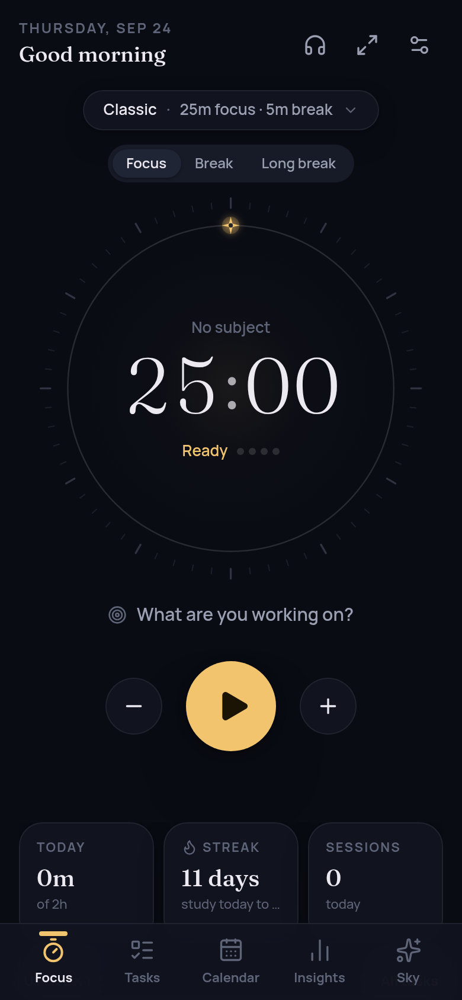
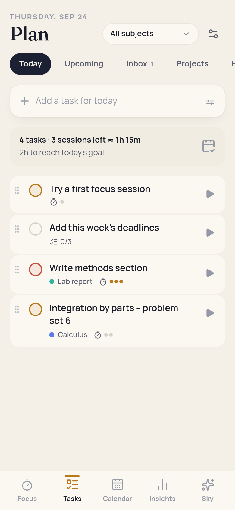
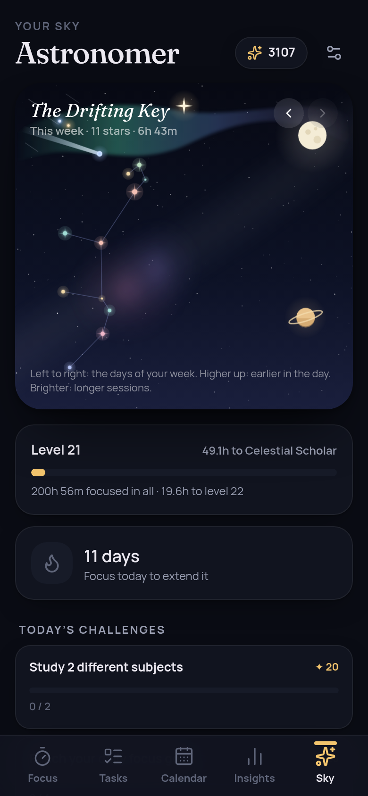
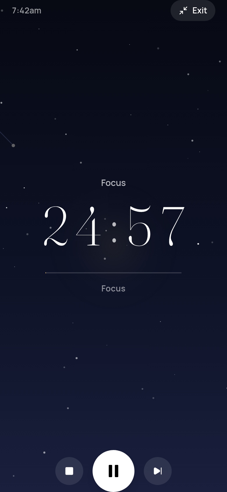
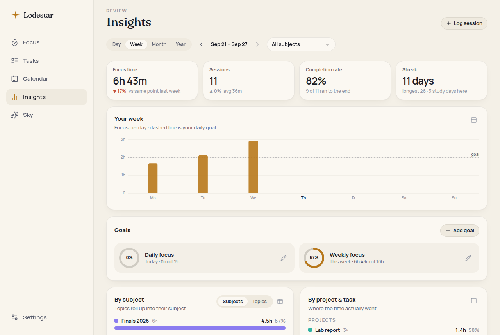

# Lodestar — study, focus, progress

A calm, premium, local‑first study app that connects the whole loop:

**PLAN → FOCUS → TRACK → REVIEW → IMPROVE**

The timer is the heart of it, but Lodestar is also a proper daily planner, an automatic session tracker, an analytics tool and a quiet game: every focus session becomes a star in your own night sky.

It runs as an installable **PWA** (offline, no account) and ships with **Capacitor** projects for **Android** and **iOS**.

| Focus (Night) | Plan (Paper) | Your sky | Immersive |
| --- | --- | --- | --- |
|  |  |  |  |



---

## Features

### Focus
- **Pomodoro cycles, countdown and open focus (stopwatch)**, with long breaks every _n_ sessions.
- **Timer profiles** (Classic 25/5, Deep work 50/10, Ultradian 90/20, Sprint, Exam block, Open focus) plus one‑tap 25/5 · 50/10 · 90/20 presets and fully custom cycles. Auto‑start breaks/focus per profile.
- Link a session to a **subject/label**, a **task** and a **project**; write an **intention** before and **notes + a 1–5 focus rating** after.
- ±5 min adjustments, skip, stop‑and‑save or discard, “finish early and take a break”.
- **Immersive mode**: full screen under your sky theme, controls fade away, screen stays awake.
- Chimes (synthesised), notifications and haptics at phase ends. Keyboard: <kbd>Space</kbd> start/pause, <kbd>F</kbd> immersive, <kbd>S</kbd> sounds.
- Open focus suggests a proportional break (⅕ of the focus time) and auto‑closes forgotten sessions after 4 h.

### Tasks & planning
- **Today / Upcoming / Inbox / Projects / Habits / Done** views, overdue section with “move all to today”.
- Separate **do‑date** (“plan for”) and **deadline** (+ time), **priorities**, **reminders**, **checklists/subtasks** (reorderable), **estimated sessions** with live progress dots, **recurring tasks** (daily, weekdays, custom weekdays, every _n_ weeks, monthly, yearly).
- **Natural‑language quick add**: `Lab report fri due mon at 5pm !high #Biology @Chemistry ~3 every wed`.
- **Drag to reorder** (Today, Inbox, projects, subtasks).
- **Convert any task straight into a timer session** (▶ on every task) — its subject and project come along.
- Daily load check: “4 tasks · 6 sessions left ≈ 2h 30m — more than your remaining goal”.
- **Calendar** (day / week / month) with **events, exams, deadlines and focus blocks** — events are separate from tasks. Time‑block a task from its sheet; start the timer from the block. Recurring events. Each day shows **planned (blocks) vs actual (sessions)** side by side.
- **Habits**: tick‑off habits, and **focus habits** that fill themselves from timer sessions (“20 min of Spanish a day”). Streaks per habit, reminder times.
- Completion history grouped by day; recurring series remember how often they were completed.

### Labels
Flexible hierarchy — **Exam › Subject › Topic** — or a flat list. Sessions roll up through the tree in stats and goals.

### Insights (all derived from session data)
Day / week / month / year with navigation and a subject filter that scopes everything:
- focus time, sessions, average length, completion rate, streak (current & longest), study days — with **deltas vs the same point of the previous period**;
- focus per hour / day / month with your **daily goal line**; **by subject** (rolled up or per topic), **by project and task**;
- **planned vs actual**: scheduled focus blocks vs focused time, tasks done vs planned, **estimate accuracy** per task;
- **best weekdays and hours**, **12‑month calendar heatmap**, **12‑week trend**;
- **goals** (daily / weekly / monthly, overall or per subject/project) with progress rings;
- editable **session history** and **manual logging** for study done away from the app.

Every chart has a hover/focus tooltip and a table view. Colours were validated for contrast and colour‑vision deficiency.

### Your sky (progression)
- Each week’s sessions form a **constellation**: left→right is the day, height is the time of day, brightness is duration, colour is the subject; stars are joined by a minimum spanning tree and every week gets a name (“The Quiet Heron”).
- **Ranks and levels** from total focus time; **celestial collection** of 15 milestones (crescent moon at 5 h, aurora at 25 h, ringed planet at 100 h, pole star for a 7‑day streak, …) that appear in your sky.
- **Daily and weekly challenges** (deterministic per date) that reward **stardust**; spend it on **sky themes** that also colour immersive mode.
- **Atlas** of past weeks. Nothing is a counter — it is all computed from your sessions.

### Sound
- 14 **procedurally generated soundscapes** — rain, thunder, ocean, wind, stream, fireplace, birdsong, night crickets, café murmur, study clock, white/pink/brown noise, alpha drone. Zero audio files: each is rendered once into a seamless loop, so they are offline, tiny and keep playing in the background.
- **Layer and mix** with per‑sound and master volume, **save presets**, optionally **follow the timer** (play during focus, fade for breaks), Media Session integration.
- **YouTube / YouTube Music**: save links; YouTube videos/playlists play in the **official embedded player**, kept visible while playing (minimising unloads it); YouTube Music links open in the YouTube Music app. No background/Premium workarounds.

### Data
- Local‑first IndexedDB; no account. Browser storage is marked persistent.
- **JSON backup / restore** (merge — newest wins — or replace), **CSV export/import** for sessions and tasks (handles quoting, BOM, formula‑injection).
- Sample history you can add and remove cleanly, to preview Insights and the sky.

---

## How the timer stays correct

`setInterval` is never the source of truth. The timer state (`src/timer/engine.ts`) stores **timestamps** — when the running segment started and how much time was banked before it — and every read derives elapsed/remaining time from the clock. It is persisted to `localStorage` on every transition.

Whenever the app might have been asleep (render tick, `visibilitychange`, focus, `pageshow`, back online, Capacitor `resume`, reload, another tab) the pure `reconcile(state, now)` function **replays what happened**: phases that ended are closed at the exact moment they ended, sessions are recorded, and auto‑started phases are chained (inserting long breaks) exactly as a foreground timer would have. Each phase has a stable id that becomes the session id, so replaying an effect twice (two tabs, a reload) can never double‑count. Clock jumps backwards never produce negative time.

Alerts:
- **Android/iOS (Capacitor)**: upcoming phase ends are **scheduled with the OS** (`LocalNotifications`, exact + allow‑while‑idle), so they fire even if the app is suspended or killed; if the app is on screen at that moment the OS alert is withdrawn and the in‑app chime plays instead. Screen stays awake via KeepAwake.
- **Web/PWA**: a single one‑shot timeout at the end time plays the chime and shows a notification through the service worker. Browsers cannot schedule notifications for a frozen page, so on mobile web an alert may arrive when you return — but the timer itself is always right.

This is covered by unit tests (`src/timer/engine.test.ts`) and was verified in Chromium end‑to‑end: start, pause, simulate 26 minutes of sleep, reload → exactly one 25:00 session recorded at its true end time, break auto‑started with the correct remaining time, no duplicates on further reloads.

---

## Architecture

**React 19 + TypeScript + Vite 8 + Tailwind CSS 4 + Dexie (IndexedDB) + Zustand + Motion + vite‑plugin‑pwa + Capacitor 8.** No chart, date or UI kit dependencies — charts, the sky and the audio are hand‑built.

```
src/
  app/          App shell, navigation, hash router, theming, global UI state
  data/         Typed data model, Dexie schema, repo (timestamps + tombstones),
                seed defaults, reactive hooks, JSON backup, CSV, sync layer, sample data
  timer/        Pure timer engine (+ tests), persistent store, useNow
  planner/      Recurrence rules, natural-language quick add, task selectors/commands, habits
  stats/        Derived analytics: ranges, series, breakdowns, streaks, goals, planned vs actual
  game/         Sky layout (constellations), progression (levels, milestones, stardust, themes), challenges
  audio/        Shared AudioContext, synthesised chimes, procedural soundscapes, mixer, YouTube helpers
  services/     Notifications, reminders, haptics, wake lock, lifecycle, fullscreen, files, install
  ui/           Design-system primitives (Sheet, controls, toasts, rings, menus…)
  features/     Screens: focus, tasks, calendar, insights, sky, settings, audio, onboarding
```

### Data model
`Label` (hierarchical), `Project`, `Task` (+ subtasks, recurrence, series), `Session`, `TimerProfile`, `Goal`, `Habit` + `HabitLog`, `CalendarEvent` (events, exams, deadlines, focus blocks; recurring), `AudioPreset`, `Playlist`, `Unlock`, `ChallengeClaim`, `Settings`. Reminders are **derived** from tasks, events and habits (so they can’t drift) with a small delivery log.

### Sync‑ready
Every record has a UUID, `createdAt` and `updatedAt`; deletes write **tombstones**. `src/data/sync.ts` provides `changesSince(cursor)`, a last‑write‑wins `applyChanges`, and a `SyncAdapter` interface — the JSON import already uses the same merge. A cloud backend only needs to implement `pull`/`push`.

---

## Getting started

```bash
npm install
npm run dev        # http://localhost:5173
npm test           # unit + data-layer tests (Vitest)
npm run build      # typecheck + production build with service worker
npm run preview    # serve the production build
```

Host `dist/` on any static host (hash routing needs no server config). Use `BASE=/subpath/ npm run build` for sub‑path hosting.

### Install as an app (PWA)
Open the site in Chrome/Edge/Safari and choose **Install** / **Add to Home Screen**. Home‑screen shortcuts: *Start focus*, *Today’s tasks*, *Add a task*, *Insights*.

### Android
Requires Android Studio.
```bash
npm run cap:android     # build, sync and open the Android project
```
Includes branded icons, adaptive icon, splash screens, notification icon, a `lodestar://` deep‑link scheme and long‑press launcher shortcuts (Start focus / Today / Add task). Android 12+ may ask to allow exact alarms for on‑time timer alerts.

### iOS
Requires macOS + Xcode.
```bash
npm run cap:ios
```
The project is generated (Swift Package Manager) with icon, splash and the `lodestar://` URL scheme.

### Icons
`assets/icon.svg` is the source. Regenerate every PNG (PWA, Android, iOS) with:
```bash
npm i -D playwright-core && node scripts/generate-icons.mjs
```

---

## Notes & limits
- **Web notifications while the phone is locked**: browsers don’t allow scheduling local notifications ahead of time, so the PWA alerts when it next runs. Use the Android/iOS build for guaranteed on‑time alerts.
- **iOS PWA audio** pauses when the screen locks (a Safari restriction); the native iOS build does not have this limitation for the timer alerts.
- **YouTube**: only the official embedded player and links are used. Background or ad‑free playback remains a YouTube Premium feature of YouTube’s own apps.
- **Widgets**: Android/iOS home‑screen widgets need native code and are not included yet; launcher shortcuts and deep links are in place for them to build on.
