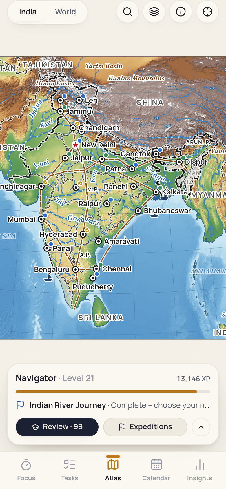
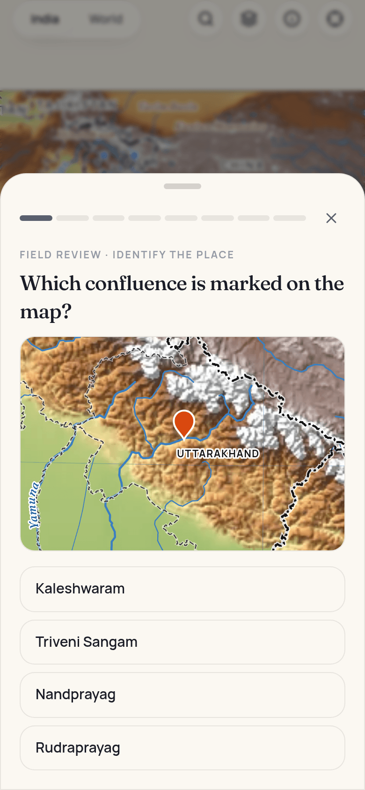
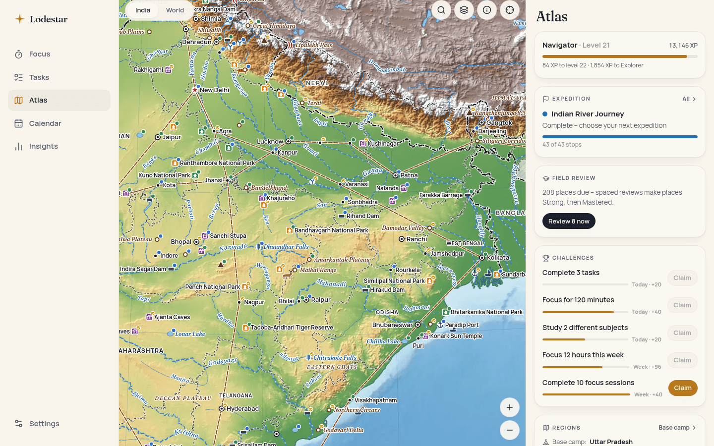

# Tars — study, focus, progress

A calm, premium, local‑first study app that connects the whole loop (formerly **Lodestar**):

**PLAN → FOCUS → TRACK → REVIEW → IMPROVE**

The timer is the heart of it, but Tars is also a proper daily planner, an automatic session tracker, an analytics tool and **The Atlas**: a real atlas of India and the world that you explore with focus time and make your own through recall — built around the geography asked in UPSC and UPPCS exams.

It runs as an installable **PWA** (offline, no account) and ships with **Capacitor** projects for **Android** and **iOS**.

| Focus (Night) | Plan (Paper) | The Atlas | Field review |
| --- | --- | --- | --- |
|  |  |  |  |




---

## Features

### Focus
- **Pomodoro cycles, countdown and open focus (stopwatch)**, with long breaks every _n_ sessions.
- **Timer profiles** (Classic 25/5, Deep work 50/10, Ultradian 90/20, Sprint, Exam block, Open focus) plus one‑tap 25/5 · 50/10 · 90/20 presets and fully custom cycles. Auto‑start breaks/focus per profile.
- Link a session to a **subject/label**, a **task** and a **project**; write an **intention** before and **notes + a 1–5 focus rating** after.
- ±5 min adjustments, skip, stop‑and‑save or discard, “finish early and take a break”.
- **The timer screen**: large Manrope tabular digits that never shift, a progress ring that moves continuously (requestAnimationFrame, no React render per frame), clearly different idle / running / paused states (the head's halo breathes while running; paused, the arc greys and the time blinks slowly), a Pomodoro · Timer · Stopwatch switch on the same dial, tactile controls (press ripple, morphing play/pause) and a short completion moment (the ring blooms, a chime plays, then the “how did it go?” card). While focus runs, the sidebar, tab bar and side panels recede and come back on hover, pause or stop. It fits the viewport at every size – no page scroll on laptops and desktops.
- **Immersive mode**: a full-screen clock on a plain dark background (bold tabular digits, end time underneath); controls fade away, screen stays awake. Optionally (Settings › Atlas) your expedition's night chart sits behind it, the route inking forward as the session runs.
- Chimes (synthesised), notifications and haptics at phase ends. Keyboard: <kbd>Space</kbd> start/pause, <kbd>F</kbd> immersive, <kbd>S</kbd> sounds. Leaving the browser's full screen (Escape) leaves immersive mode too.
- Open focus suggests a proportional break (⅕ of the focus time) and auto‑closes forgotten sessions after 4 h.

### Tasks & planning
- **Today / Upcoming / Inbox / Projects / Habits / Done** views, overdue section with “move all to today”.
- Separate **do‑date** (“plan for”) and **deadline** (+ time), **priorities**, **reminders**, **checklists/subtasks** (reorderable), **estimated sessions** with live progress dots, **recurring tasks** (daily, weekdays, custom weekdays, every _n_ weeks, monthly, yearly).
- **Two-tier quick add**: type a line and press Enter, or open **More options** to set the subject, tags, priority, dates, estimate, timer profile, project and notes before the task is created – a new task never needs a follow-up edit.
- **Natural language**: `Physics revision tomorrow 5pm #exam ~1h` fills the date, time, tag and estimate as you type, and picks the subject up from the title (“Physics”). `@Subject`, `+Project`, `#tag`, `!high`, `~2` / `~45m` / `~1h30m`, `due fri`, `every mon`. (`#Name` still files into a project of exactly that name, as before tags existed.)
- **Subjects** from a searchable, colour-coded picker (type a new name to create one); **tags** with autocomplete and create; a task can carry its own **timer profile**, used when you focus on it.
- **Undo** instead of confirm dialogs for deleting a task or a timer profile.
- **Drag to reorder** (Today, Inbox, projects, subtasks).
- **Convert any task straight into a timer session** (▶ on every task) — its subject and project come along.
- Daily load check: “4 tasks · 6 sessions left ≈ 2h 30m — more than your remaining goal”.
- **Calendar** (day / week / month) with **events, exams, deadlines and focus blocks** — events are separate from tasks. Time‑block a task from its sheet; start the timer from the block. Recurring events. Each day shows **planned (blocks) vs actual (sessions)** side by side.
- **Habits**: tick‑off habits, and **focus habits** that fill themselves from timer sessions (“20 min of Spanish a day”). Streaks per habit, reminder times.
- Completion history grouped by day; recurring series remember how often they were completed.

### Labels
Flexible hierarchy — **Exam › Subject › Topic** — or a flat list. Sessions roll up through the tree in stats and goals.

### Insights (all derived from session data)
Day / week / month / year with navigation and a subject filter that scopes everything:
- focus time, sessions, average length, completion rate, streak (current & longest), study days — with **deltas vs the same point of the previous period**;
- focus per hour / day / month with your **daily goal line**; **by subject** (rolled up or per topic), **by project and task**;
- **planned vs actual**: scheduled focus blocks vs focused time, tasks done vs planned, **estimate accuracy** per task;
- **best weekdays and hours**, **12‑month calendar heatmap**, **12‑week trend**;
- **goals** (daily / weekly / monthly, overall or per subject/project) with progress rings;
- editable **session history** and **manual logging** for study done away from the app.

Every chart has a hover/focus tooltip and a table view. Colours were validated for contrast and colour‑vision deficiency.

### The Atlas (progression)
A bundled, full-frame atlas of India and the world that works offline. It shows the places that focus time explores and recall helps you master. **FOCUS → XP → EXPLORE → DISCOVER → MASTER.**

- **Offline study sheets**: India (Lambert conformal conic, all 36 states and UTs) and the World (Robinson). Each map covers its viewport without a paper margin; drag, pinch and scroll to explore. The India sheet follows the official Government of India depiction. These bundled sheets are also used for recall.
- **XP and ranks**: 1 XP per focused minute, +3 for finishing a planned session, challenge rewards and a little recall XP (capped at 30 a day). Wayfarer → Trailblazer → Surveyor → Cartographer → Navigator → Explorer → Geographer → Keeper of the Atlas. Map styles (Night chart, Antique) unlock with rank.
- **Expeditions** — Himalayan, Indian River Journey, Peninsular India, Northeast India, Coastal India, Indian Islands, World Physical Geography. Focus minutes carry the active expedition from stop to stop (20–60 min each). At each chapter end a **checkpoint** needs 60% of its places Familiar; minutes wait there, banked. Without an expedition, **free survey** uncovers places outward from your **base camp** state.
- **2,273 places** (1,126 India, 1,147 World) chosen for UPSC/UPPCS: passes, peaks and ranges, rivers with tributaries, banks, sources and mouths, confluences, lakes, every Ramsar site, national park, tiger reserve and biosphere reserve with a known position, plateaus, deserts, coasts and deltas, islands and channels, ports, dams, waterfalls, heritage sites, all national capitals, strategic and border locations, nuclear/space/defence sites, and places in current affairs (Nagorno-Karabakh, Gaza, the Red Sea chokepoints…) — with Uttar Pradesh in extra depth. Every place links to its Wikipedia article and Wikidata item; places added in data version 2 take their position from Wikidata and their facts verbatim from the article. Place cards show facts, designations, a breadcrumb (World › Asia › India › The Himalaya › Sikkim › Nathu La), tappable connections, past papers and a folded list of sources.
- **Every place is accessible**: rivers as courses, parks, wetlands and disputed regions as outlines, the rest as symbols. Untravelled places are drawn quietly, but their facts, connections and testing are available immediately. Focus powers Travelled history; recall establishes Familiar, Strong and Mastered. Layers controls map display; search covers both maps and opens any place.
- **Canonical previous questions**: 149 verified questions (CSE 72, PCS 30, CDS 47), with original structured content, final accepted answers and meaningful place links. Answer history credits only eligible primary places. The small complete subset is available offline after service-worker installation; question packs are read on demand. Legacy study-priority evidence remains separate.
- **Moves like a map app**: one continuous zoom-and-pan path for every camera move (fly-to, fit, double-tap), eased mouse-wheel steps around the cursor, direct trackpad/pinch zoom with momentum, two-finger tap and Shift+double-click to zoom out, keyboard pan/zoom, names that keep their size while zooming and fade in as they appear, and a cross-fade between map styles. Reduced-motion settings turn the animation off.
- **Recall decides mastery, not time**: any accessible place can become Familiar (1 correct) → Strong (3 correct, 2 question types, 2 days) → Mastered (5 correct over a week incl. a map or ordering question, 85% recent accuracy), independently of Travelled history. Field questions are generated from the gazetteer's structure — locate on the map, identify, state/country, river, connections, borders, ordering (states along a river, peaks by height, west to east) and masked facts — with plausible distractors. Spaced review on 1/3/7/16/35‑day boxes; well‑overdue places fade one mastery level on the map while travel history remains. Field review daily, "Test me" on any place, two optional questions during breaks.
- **The world fills in**: states develop from Charted → Settled → Developed → Flourishing with mastery; routes appear when their places are known (Golden Quadrilateral, North–South and East–West corridors, Konkan Railway, Kaladan, the Silk Route), ships sail off developed ports, wildlife returns to mastered parks (tiger at Corbett, rhino at Kaziranga, lion at Gir…), rivers flow once the River Journey is done.
- **Daily and weekly challenges** (deterministic per date) now include Atlas goals — review places, advance your expedition, discover, make a pass Strong.
- Existing history is **replayed** through your first expedition, so long‑time users start with part of the map explored. Everything is derived from sessions, recall answers and expedition runs — nothing is a counter that can drift.

### Sound
- 14 **procedurally generated soundscapes** — rain, thunder, ocean, wind, stream, fireplace, birdsong, night crickets, café murmur, study clock, white/pink/brown noise, alpha drone. Zero audio files: each is rendered once into a seamless loop, so they are offline, tiny and keep playing in the background.
- **Layer and mix** with per‑sound and master volume, **save presets**, Media Session integration.
- **Follows the timer** (on by default): pausing pauses the sound, resuming resumes it, stop/reset stops it and the next session starts from the top, breaks fade it out – from every path (buttons, keys, notifications, auto-started phases, other tabs), via a store subscription in `src/audio/follow.ts`. Leaving the page stops it. The soundscape and the YouTube player never play at once.
- **YouTube / YouTube Music**: save links; YouTube videos/playlists play in the **official embedded player**, kept visible while playing (minimising unloads it); YouTube Music links open in the YouTube Music app. No background/Premium workarounds.

### Data
- Local‑first IndexedDB; no account. Browser storage is marked persistent.
- **JSON backup / restore** (merge — newest wins — or replace), **CSV export/import** for sessions and tasks (handles quoting, BOM, formula‑injection).
- Sample history you can add and remove cleanly, to preview Insights and the Atlas.

### App shell & feel
- **Command palette** (<kbd>Ctrl</kbd>/<kbd>⌘</kbd> <kbd>K</kbd>): go anywhere, start/pause/stop, sounds, profiles, theme, open any task – or type a task in natural language and press Enter to capture it.
- **Keyboard shortcuts** with a reference sheet (<kbd>?</kbd>): <kbd>N</kbd> new task, <kbd>G</kbd> then <kbd>F</kbd>/<kbd>T</kbd>/<kbd>A</kbd>/<kbd>C</kbd>/<kbd>I</kbd>/<kbd>S</kbd> to go to a screen, <kbd>Ctrl</kbd>/<kbd>⌘</kbd> <kbd>\</kbd> sidebar, <kbd>Shift</kbd>+<kbd>F</kbd> full-screen Atlas.
- **Collapsible sidebar** (icons only, with tooltips), remembered across sessions and applied before first paint; it also shows your streak and an offline badge. A toast says when the connection drops or returns – nothing is lost either way.
- **Full-screen Atlas**: the chrome slides away and the browser goes full screen (Fullscreen API); Escape, the browser's own exit and leaving the Atlas all come back out. Without the API (iPhone) the map still fills the window.
- **Dialogs** are a flex column capped to the viewport: header and footer stay put, only the body scrolls and only when it must, nothing scrolls sideways, footer buttons wrap instead of overflowing; focus is trapped inside and Escape closes only the top one.
- **Motion system** (`src/ui/motion.ts` + CSS tokens in `index.css`): micro 140 ms, base 220 ms, layout 320 ms, shared easing curves and springs for dialogs, menus, lists, toasts, the sidebar and screen changes. `prefers-reduced-motion` is respected (Motion's `reducedMotion="user"`, and CSS animations collapse).

---

## How the timer stays correct

`setInterval` is never the source of truth. The timer state (`src/timer/engine.ts`) stores **timestamps** — when the running segment started and how much time was banked before it — and every read derives elapsed/remaining time from the clock. It is persisted to `localStorage` on every transition.

Whenever the app might have been asleep (render tick, `visibilitychange`, focus, `pageshow`, back online, Capacitor `resume`, reload, another tab) the pure `reconcile(state, now)` function **replays what happened**: phases that ended are closed at the exact moment they ended, sessions are recorded, and auto‑started phases are chained (inserting long breaks) exactly as a foreground timer would have. Each phase has a stable id that becomes the session id, so replaying an effect twice (two tabs, a reload) can never double‑count. Clock jumps backwards never produce negative time.

Alerts:
- **Android/iOS (Capacitor)**: upcoming phase ends are **scheduled with the OS** (`LocalNotifications`, exact + allow‑while‑idle), so they fire even if the app is suspended or killed; if the app is on screen at that moment the OS alert is withdrawn and the in‑app chime plays instead. Screen stays awake via KeepAwake.
- **Web/PWA**: a single one‑shot timeout at the end time plays the chime and shows a notification through the service worker. Browsers cannot schedule notifications for a frozen page, so on mobile web an alert may arrive when you return — but the timer itself is always right.

This is covered by unit tests (`src/timer/engine.test.ts`) and was verified in Chromium end‑to‑end: start, pause, simulate 26 minutes of sleep, reload → exactly one 25:00 session recorded at its true end time, break auto‑started with the correct remaining time, no duplicates on further reloads.

---

## Architecture

**React 19 + TypeScript + Vite 8 + Tailwind CSS 4 + Dexie (IndexedDB) + Zustand + Motion + vite‑plugin‑pwa + Capacitor 8.** No chart, map, date or UI kit dependencies — charts, the map renderer and the audio are hand‑built (the only map dependency at runtime is `topojson-client`).

```
src/
  app/          App shell, navigation, hash router, theming, global UI state
  data/         Typed data model, Dexie schema, repo (timestamps + tombstones),
                seed defaults, reactive hooks, JSON backup, CSV, sync layer, sample data
  timer/        Pure timer engine (+ tests), persistent store, useNow
  planner/      Recurrence rules, natural-language quick add, task selectors/commands, habits
  stats/        Derived analytics: ranges, series, breakdowns, streaks, goals, planned vs actual
  game/         Progression (XP, levels, ranks, map styles) and challenges
  atlas/        Atlas engine: sheet decoding, gazetteer index, exploration (expeditions,
                gates, survey), mastery + spaced review, question generators, living world
  audio/        Shared AudioContext, synthesised chimes, procedural soundscapes, mixer, YouTube helpers
  services/     Notifications, reminders, haptics, wake lock, lifecycle, fullscreen, files, install
  ui/           Design-system primitives (Sheet, controls, toasts, rings, menus…)
  features/     Screens: focus, tasks, atlas, calendar, insights, settings, audio, onboarding
tools/atlas-build/   Offline data pipeline that produces public/atlas/v1 (see below)
```

### Data model
`Label` (hierarchical), `Project`, `Task` (+ subtasks, recurrence, series, optional `tags` and `profileId` – not indexed, so no schema change), `Session`, `TimerProfile`, `Goal`, `Habit` + `HabitLog`, `CalendarEvent` (events, exams, deadlines, focus blocks; recurring), `AudioPreset`, `Playlist`, `ChallengeClaim`, `RecallAttempt`, `ExpeditionRun`, `Settings`. Geographic data is static and versioned under `public/atlas/v1`; user progress refers to places only by stable ids such as `in.pass.nathu-la`. Schema v2 migrates the Sky version (sky‑theme purchases dropped, challenge rewards kept as XP), and v1 backups still import. Reminders are **derived** from tasks, events and habits (so they can’t drift) with a small delivery log.

### Sync‑ready
Every record has a UUID, `createdAt` and `updatedAt`; deletes write **tombstones**. `src/data/sync.ts` provides `changesSince(cursor)`, a last‑write‑wins `applyChanges`, and a `SyncAdapter` interface — the JSON import already uses the same merge. A cloud backend only needs to implement `pull`/`push`.

---

## Getting started

```bash
npm install
npm run dev        # http://localhost:5173
npm test           # unit + data-layer tests (Vitest)
npm run build      # typecheck + production build with service worker
npm run preview    # serve the production build
```

Host `dist/` on any static host (hash routing needs no server config). Use `BASE=/subpath/ npm run build` for sub‑path hosting.

### Install as an app (PWA)
Open the site in Chrome/Edge/Safari and choose **Install** / **Add to Home Screen**. Home‑screen shortcuts: *Start focus*, *Today’s tasks*, *Add a task*, *Insights*.

### Android
Requires Android Studio.
```bash
npm run cap:android     # build, sync and open the Android project
```
Includes branded icons, adaptive icon, splash screens, notification icon, a `tars://` deep‑link scheme (the old `lodestar://` still opens the app) and long‑press launcher shortcuts (Start focus / Today / Add task). Android 12+ may ask to allow exact alarms for on‑time timer alerts.

### iOS
Requires macOS + Xcode.
```bash
npm run cap:ios
```
The project is generated (Swift Package Manager) with icon, splash and the `tars://` URL scheme (plus the old `lodestar://`).

### Atlas data
`public/atlas/v1` is generated by `tools/atlas-build` (its own package) and committed. It powers the offline study maps, recall and place search:

| File | Contents |
| --- | --- |
| `india.json`, `world.json` | Pre‑projected TopoJSON: countries, states, rivers, lakes, boundaries (classified), graticule, label positions |
| `india-relief.webp`, `world-relief.webp` | Physical plate: hypsometric tints, bathymetry and hillshade |
| `india-shade.webp`, `world-shade.webp` | Hillshade for the political plate |
| `places.json` | The gazetteer, expeditions, states and countries |
| `india-overlay.json`, `world-overlay.json` | Courses and outlines for gazetteer places the base sheets don't draw (rivers, parks, wetlands, lakes, disputed and physical regions), matched by Wikidata id from Natural Earth 1:10m and OpenStreetMap |

```bash
cd tools/atlas-build && npm install
node build.mjs                # everything (downloads sources on first run, then caches them)
node build.mjs --no-relief    # vectors + places only
node build.mjs --places-only  # recompile content/*.mjs into places.json (+ overlays)
node gazetteer/lists.mjs         # refresh the official lists (Ramsar, tiger reserves, national parks, biosphere reserves, capitals)
node gazetteer/link-existing.mjs # link version 1 places to Wikipedia/Wikidata (provenance, coordinate audit)
node gazetteer/generate.mjs      # candidates → sourced places (content/generated), deduplicated against the gazetteer
```
**Version 2 of the gazetteer** is generated from curated candidate lists (`content/candidates`) and official lists: every position comes from Wikidata, the article or (for a few designated sites without either) OpenStreetMap, and every fact is a sentence from the cited article — see `docs/HANDOFF.md` §10. Version 1 places keep their ids, levels and fog units (`content/sources/v1-lock.json`), so existing progress is untouched.

The build checks every place against the state it claims, links rivers, lakes, seas and regions to their shapes, resolves every relation and traces rivers that Natural Earth lacks (Luni, Sabarmati, Gomti, Damodar…) on the terrain model.

**Previous-year questions (PYQs).** `tools/atlas-build/content/pyq/` is a ledger with one `Q(exam, year, question, places, { topic, source })` entry per question that names a place. Every entry needs a source (a link, or `pdf:<file>#p<page>`). The build matches places by id, name or alias and writes names it cannot match to `tools/atlas-build/reports/pyq-review.json`. It then gives each place its exam history (`pyq: count, years, exams, topics, sources`) and a **study priority** (`yield: score, band, parts, reasons`). The priority is weighted from frequency, recurrence across years, recency, syllabus importance, links to other asked places, and "important but under-tested". It is a heuristic for ordering study, not a prediction, and the app shows the reasons with it: a "Past papers" panel on place cards, a study-priority order in the gazetteer, and priority-first introduction of new places in review. The ledger holds 783 entries transcribed from UPPSC question papers (1990–2026) and the UPSC CSE Prelims sections of a PYQ workbook, each citing its PDF page; names that are deliberately not atlas places are listed with a reason in `content/pyq/not-mapped.mjs`. Run `npm test` in `tools/atlas-build` for the pipeline tests.

### Performance tooling
`tools/perf` (its own package) drives headless Chromium on a phone-sized viewport. Run it against a production build: `npm run build && npm run preview`, then in `tools/perf` run `npm install`.
- `node profile.mjs <label>` measures the Atlas: pans and wheel zooms at 4× CPU throttle, reporting frame times and long tasks.
- `node smoke.mjs` runs a touch smoke test: timer, sheets, every screen, Atlas tap/pan/pinch, and offline reload.
- `node screens.mjs` screenshots every screen on phone and desktop, in light and dark.
- `node atlas-check.mjs` checks Atlas interaction on desktop and phone: wheel notches, double-click/tap, Shift+double-click, two-finger tap, keys, hover, layers, and search → fly → card across sheets.
- `node trace.mjs wheel|wheelout|notch|pan|pinch` records a Chrome trace of one gesture and prints where the main-thread time went.
- `node pyqcheck.mjs` prints the gazetteer's study-priority order and the "Past papers" panel of the places you name.
- `node ui-audit.mjs [url] [filter]` opens every screen and dialog at 375 / 768 / 1366 / 1920 px in light and dark and fails on unwanted scrollbars: page overflow, anything scrolling sideways, footer buttons out of view, near-useless dialog scrollbars. Screenshots go to `out/audit/`.
- `node features-check.mjs` (against `npm run dev`) checks sound following the timer, task creation with subject/tags, undo, the command palette, sidebar persistence and full-screen sync end to end.

The Atlas renderer moves already-painted layers while you drag or pinch, then repaints names when the view settles. See `docs/HANDOFF.md` for its original measurements.

**Sources and licences** (see `public/atlas/v1/ATTRIBUTION.txt`): Natural Earth (public domain; India drawn from its India point‑of‑view boundaries), DataMeet state boundaries (CC BY 4.0), relief and traced rivers from AWS Terrain Tiles (SRTM, GMTED2010, ETOPO1), outlines and some river courses © OpenStreetMap contributors (ODbL), places and facts from Wikipedia (CC BY-SA 4.0) and Wikidata (CC0), designations from the Ramsar Sites Information Service, NTCA and MoEFCC/UNESCO lists. The Atlas is a study aid, not an authoritative map.

### Deployment
`vercel.json` builds the PWA on Vercel (`npm ci && npm run build`, output `dist`): hashed assets are cached for a year, the service worker, manifest and the atlas data revalidate on every load so updates reach users. `.vercelignore` keeps the PYQ PDFs, native shells and tools out of the upload.

The canonical, Open Graph and Twitter tags in `index.html` use `%SITE_URL%`, filled in at build time from Vercel's `VERCEL_PROJECT_PRODUCTION_URL` (or `SITE_URL`), so they follow the project's production domain when it is renamed.

### Icons
`assets/icon.svg` is the source (the Tars mark: four slabs – four focus blocks to a cycle – standing together as a T). Regenerate every PNG (PWA, Android, iOS) and the social preview image `public/og-image.png` with:
```bash
npm i -D playwright-core && node scripts/generate-icons.mjs
```

---

## Notes & limits
- **Web notifications while the phone is locked**: browsers don’t allow scheduling local notifications ahead of time, so the PWA alerts when it next runs. Use the Android/iOS build for guaranteed on‑time alerts.
- **iOS PWA audio** pauses when the screen locks (a Safari restriction); the native iOS build does not have this limitation for the timer alerts.
- **YouTube**: only the official embedded player and links are used. Background or ad‑free playback remains a YouTube Premium feature of YouTube’s own apps.
- **Widgets**: Android/iOS home‑screen widgets need native code and are not included yet; launcher shortcuts and deep links are in place for them to build on.
- **Place coordinates** were curated by hand and checked by the build against state boundaries; GeoNames/Wikidata were not reachable from the build environment, so a few positions (especially small wetlands) may be approximate.
